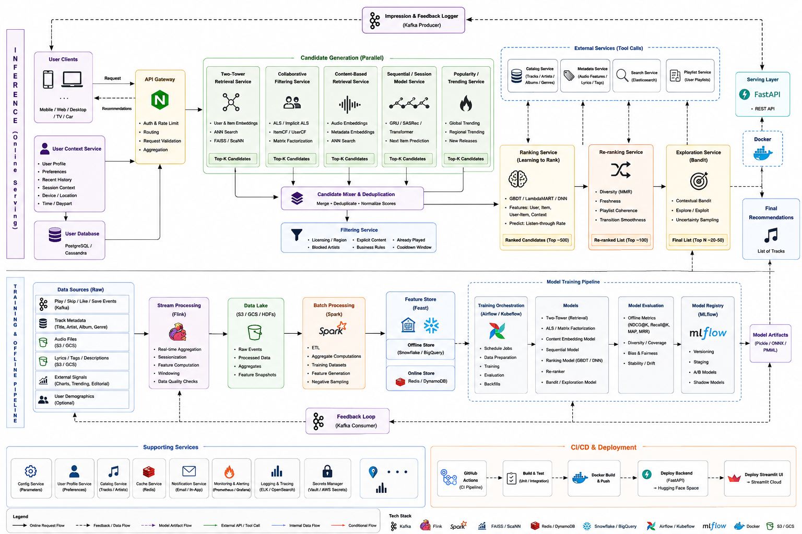

# PulseMix

A music recommendation system built on the Million Song Dataset, combining content-based retrieval, classical ML baselines, and deep representation learning behind a Streamlit UI and a deployable service layer.

## Architecture

```
Million Song Dataset (item catalog)
User interaction data (optional: play_count, likes, skips, sessions)
              │
              ▼
   Feature Engineering
   - Audio feature extraction / compression
   - Normalization
   - Feature store
              │
              ▼
        Model Hub
   - Content-based retrieval (nearest-neighbor over embeddings)
   - Collaborative filtering (matrix factorization, requires interaction data)
   - Hybrid ranking (blends content + collaborative signals)
   - Classical ML baselines (year prediction)
   - Deep autoencoder (latent representation learning)
              │
              ▼
    API & Services Layer
   - Recommendation service (REST)
   - Pipeline orchestration (train / eval / infer)
   - Business logic (users, sessions, personalization)
              │
              ▼
        Streamlit UI
```



## Components

| Layer | Description |
|---|---|
| Content-based retrieval | Nearest-neighbor search over compressed MSD audio embeddings |
| Collaborative filtering | User-item matrix factorization, activates once interaction data is available |
| Hybrid ranking | Combines content and collaborative signals |
| Classical ML baseline | Year-prediction model for evaluation/debugging |
| Deep autoencoder | Learns latent representations from audio features |
| Recommendation service | REST API for serving personalized recommendations |
| Streamlit UI | Interactive browsing/search interface |

## Project Structure

```
src/project_folder/
├── .github/workflows/       # ci.yml, cd.yml
├── artifacts/
│   ├── models/               # trained model artifacts
│   └── reports/               # evaluation reports, visualizations
├── conf/config.yaml           # project configuration
├── data/                       # raw / processed data
├── docker/                     # Docker assets
├── docs/CI_CD.md
├── k8s/
│   ├── deployment.yaml
│   └── service.yaml
├── notebooks/music_reco.ipynb
├── scripts/
├── src/music_recommendation/
│   ├── data/                   # loading, preprocessing
│   ├── features/                # feature engineering
│   ├── models/                   # recommender implementations
│   ├── pipelines/                 # train / predict pipelines
│   ├── services/                   # API / business logic
│   ├── ui/                          # Streamlit components
│   └── utils/
├── tests/test_pipeline.py
├── main.py                          # app entry point
├── pyproject.toml
├── QUICKSTART.md
├── streamlit_app.py
└── uv.lock
```

## Requirements

- Python (managed via `uv`)
- `pip install uv`

## Setup

```bash
cd src/project_folder
uv sync
```

## Usage

```bash
# Train models
uv run music-rec train

# Launch UI
uv run streamlit run streamlit_app.py

# Run tests
uv run pytest tests/

# Lint / format
uv run ruff check .
uv run ruff format .
```

## Docker

```bash
docker build -t pulsemix:latest src/project_folder
docker run -p 8501:8501 pulsemix:latest uv run streamlit run streamlit_app.py
```

Kubernetes manifests: `src/project_folder/k8s/deployment.yaml`, `src/project_folder/k8s/service.yaml`

## Data

Item features currently come from `YearPredictionMSD.csv`. Collaborative filtering and hybrid ranking require user interaction data in one of the following forms:

```
user_id,track_id,rating
```
or implicit feedback: `play_count`, `like`, `skip`, `session_id`, `timestamp`.

Without this data, the system falls back to content-based retrieval and the classical ML baseline only.

## Documentation

- [QUICKSTART.md](src/project_folder/QUICKSTART.md)
- [notebooks/music_reco.ipynb](src/project_folder/notebooks/music_reco.ipynb)
- [docs/CI_CD.md](src/project_folder/docs/CI_CD.md)

## License

Not currently specified.
